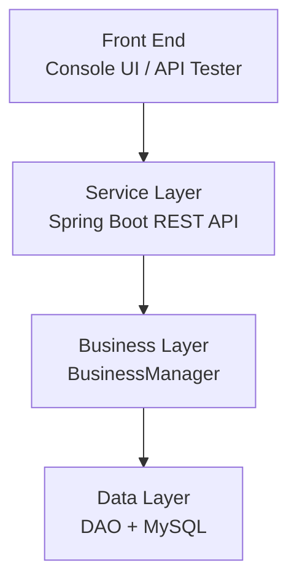

# Architecture Diagram (N-Tier)

```mermaid
flowchart TB
  FE["Front End<br/>Console UI / API Tester"] --> SL["Service Layer<br/>Spring Boot REST API"]
  SL --> BL["Business Layer<br/>BusinessManager"]
  BL --> DL["Data Layer<br/>DAO + MySQL"]
```
